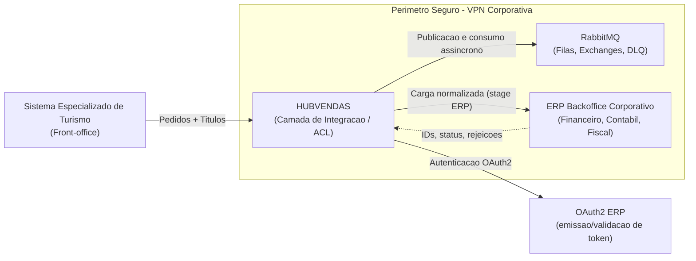
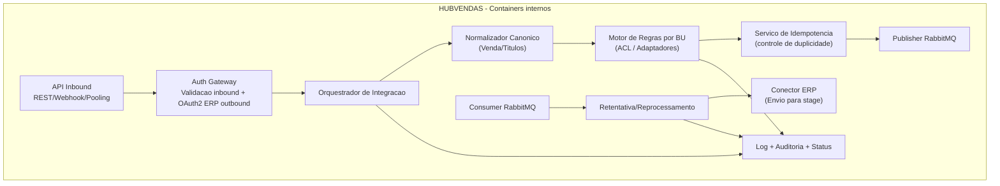
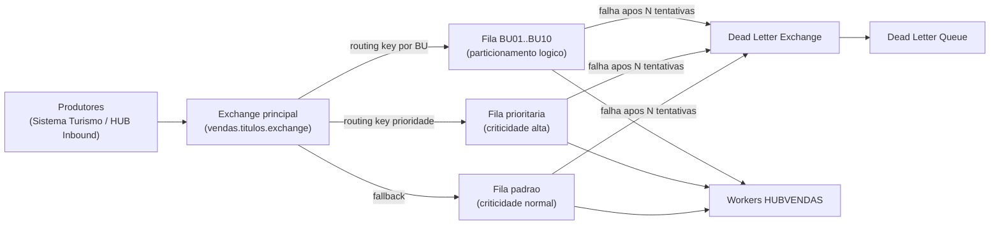
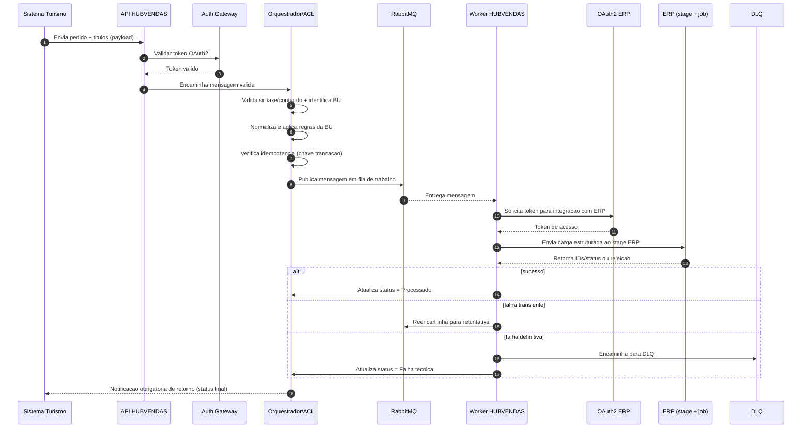

# HUBVENDAS

Camada de integracao responsavel por centralizar, orquestrar e transformar o fluxo de dados operacionais originados no sistema especializado de turismo em direcao ao ERP de backoffice.

## Descricao da Solucao

O HUBVENDAS atua como um barramento intermediario inteligente entre o front-office de turismo e o ERP corporativo, com foco em:

- desacoplamento entre origem de vendas e core de backoffice;
- processamento assincrono com RabbitMQ;
- isolamento de regras de negocio por Unidade de Negocio (10 BUs);
- resiliencia, idempotencia e rastreabilidade ponta a ponta;
- seguranca por token, incluindo OAuth2 gerenciado pelo ERP nas chamadas da integracao para o ERP, e comunicacao restrita a VPN.

A camada recebe transacoes de pedidos de venda e titulos a receber, valida e normaliza os dados, aplica regras por BU, publica/consome filas e encaminha cargas estruturadas para um stage no ERP, onde jobs internos distribuem o processamento para os modulos corporativos.

## Diagramas Estruturais (Mermaid)

### 1) Contexto de Integracao (visao macro)

### 2) Containers Internos da Camada HUBVENDAS

### 3) Topologia Logica de Mensageria (RabbitMQ)

## Diagrama Comportamental (Mermaid)

### 4) Sequencia - Jornada critica de pedido/titulo ate confirmacao no ERP

## Conceitos de Mensageria

- **Fila de trabalho:** fila principal onde as transacoes validas aguardam processamento assincrono.
- **Retentativa (retry):** nova tentativa automatica quando ocorre falha transiente (ex.: indisponibilidade temporaria do ERP).
- **Backoff:** estrategia de espacamento entre tentativas (ex.: progressivo/exponencial) para reduzir sobrecarga e aumentar chance de recuperacao.
- **DLQ (Dead Letter Queue):** fila de isolamento para mensagens que falharam apos o limite de tentativas ou possuem erro nao recuperavel.
- **Reprocessamento:** rotina operacional para analisar mensagens da DLQ, corrigir causa raiz e reenviar com seguranca.

## Decisoes e Ajustes de Modelagem

A especificacao traz alguns pontos em aberto. Para viabilizar uma representacao arquitetural coerente e renderizavel em Mermaid, foram adotados os ajustes abaixo:

1. **Topologia de filas representada como hibrida (BU + criticidade):**
   como a especificacao lista a topologia como lacuna, o diagrama mostra uma alternativa que combina roteamento por BU e por prioridade para refletir escalabilidade e controle operacional.

2. **Conector de ERP modelado com stage intermediario:**
   foi explicitado no fluxo que o HUB envia para um stage do ERP e que um job interno do ERP conclui a distribuicao aos modulos, alinhado ao texto da especificacao.

3. **OAuth2 representado como responsabilidade do ERP:**
   o fluxo de autenticacao para chamadas da integracao ao ERP foi modelado como servico OAuth2 gerenciado pelo proprio ERP, deixando explicita essa fronteira de responsabilidade.

4. **Feedback para sistema de origem definido como obrigatorio:**
   a notificacao de retorno foi modelada como etapa obrigatoria ao final do processamento, garantindo visibilidade de status para o sistema de origem.

5. **Containers internos organizados por responsabilidade (nao por tecnologia):**
   os componentes internos da camada foram definidos por capacidades (auth, orquestracao, regras BU, idempotencia, retry, auditoria) para manter aderencia ao nivel logico pedido.

6. **DLQ e retentativas separadas no comportamento:**
   a jornada critica explicita falha transiente versus falha definitiva para evidenciar resiliencia, sem fixar politicas numericas ainda nao definidas.

## Fonte da Especificacao

Documento base: `.vscode/especificacao_camada_integracao.md`.
